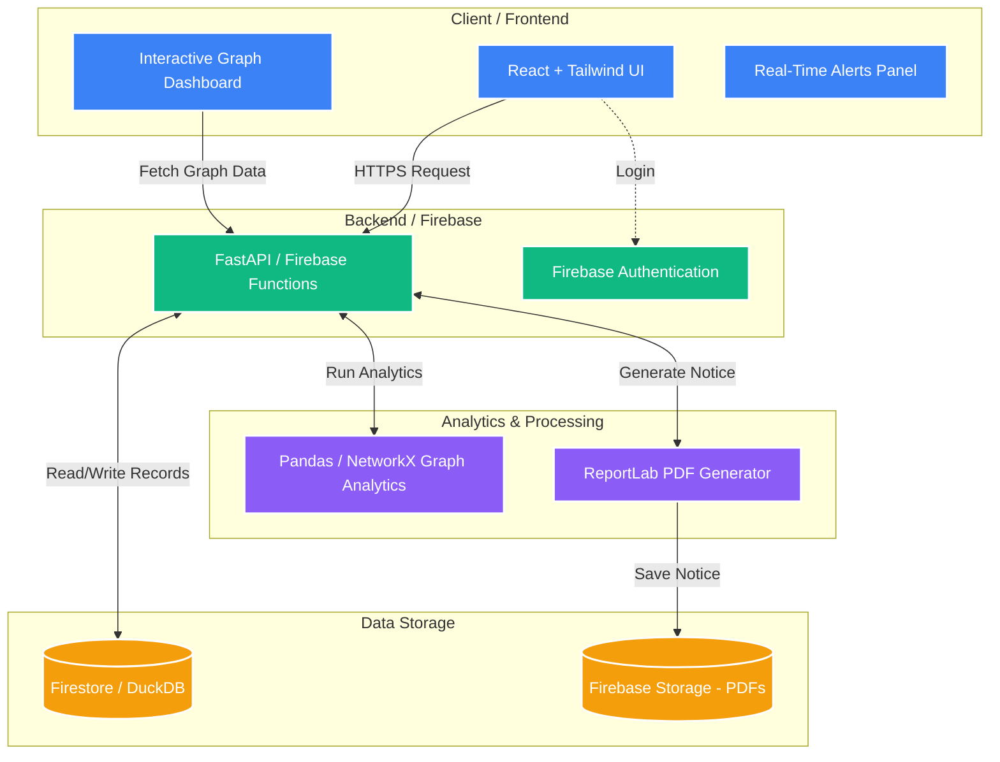

# FRAUDTRACE – Operation Abhedya‑Chakra 🛡️

> *"Intercepting fraud before money leaves the country"*

**Event:** Void Hacks 8.0  
**Theme:** Cyber Security & Digital Forensics  
**In Association with:** Indore Police Commissionerate  

---

## 📑 Project Overview

**FRAUDTRACE** is a high-throughput, locally deployable analytics engine designed to assist law enforcement agencies in tracking multi-tier money laundering patterns and financial cybercrimes (e.g., digital arrests, Ponzi schemes, loan app frauds). 

When investigating major fraud syndicates, police receive bulk transaction exports containing millions of entries. Traditional tools crash or are too slow, and criminals use complex multi-layer mule networks. FRAUDTRACE ingests millions of records in seconds, detects mule networks using graph analytics, and generates court-ready evidence to freeze accounts instantly.

## 🚀 Key Objectives

- **High-Speed Ingestion:** Load and index 2M+ banking records in under 60 seconds without OOM errors.
- **Deep Tracing:** Trace the victim trail up to 4 hops in under 2 seconds.
- **Mule Detection:** Detect "Collector", "Distributor", and "Cash-Out" nodes using fan-in/fan-out graph algorithms.
- **Actionable Output:** Generate interactive visualizations, automated case diaries, and legally sound bank freeze requisitions (Section 91 CrPC).
- **Evidentiary Integrity:** Maintain a tamper-proof audit trail for court evidence.

## 🏗️ System Architecture



* **Frontend:** React + Tailwind CSS (Dashboard, Graph UI, Alerts, Freeze panel)
* **Backend:** FastAPI + Python / Firebase Cloud Functions (APIs for ingestion, analytics, risk scoring)
* **Database:** DuckDB/SQLite (Local) or Firebase Firestore (Cloud)
* **Analytics Engine:** Pandas + NetworkX (Mule detection, velocity checks, predictive simulation)
* **Reporting:** ReportLab / Jinja2 (Case diary & freeze requisition PDF generation)

## 🧩 Core Modules

### 1. Data Ingestion & Normalization Engine
Streams and indexes big-data chunks efficiently. Normalizes entities like account numbers, IFSC codes, payment rails (UPI/IMPS), IP anomalies, and device profiles.

### 2. Graph Analytics Engine
Implements heuristics to score accounts on a 0–100 Mule Risk Index:
*   **Layer 1 (Collector Mules):** Fan-In detection.
*   **Layer 2 (Distributor Mules):** Fan-Out detection & high-velocity pass-through.
*   **Layer 3 (Terminal Cash-Out):** Foreign IPs, P2P crypto narrations, headless scripts.

### 3. Interactive Visualization
Renders clustered suspect subgraphs in sub-second speeds. Includes a temporal playback slider to track the exact propagation of stolen capital minute-by-minute.

### 4. Local AI Case Officer
Auto-generates a structured, chronological Police Case Diary and a legally sound Bank Freeze Requisition with strict anti-hallucination guardrails.

## ⚙️ Workflow

1. **Upload:** Officer logs in (Firebase Auth) and uploads dataset.
2. **Trace:** Queries a victim account. The backend computes the multi-hop money trail.
3. **Detect:** System identifies the mule network structure and calculates risk indices.
4. **Report:** Officer generates Section 91 CrPC Freeze Notice + Case Diary PDFs.
5. **Audit:** Every API call and report generation is logged in a tamper-proof `Audit_Log`.
6. **Alerts:** Real-time triggers alert officers of suspicious dispersal anomalies.

## 🗺️ Roadmap

*   **Phase 1 (MVP):** Data ingestion, graph analytics, freeze notice generation.
*   **Phase 2 (Advanced):** Audit trail, real-time alerts, geo-mapping of IPs.
*   **Phase 3 (Future):** Cross-bank integration, ML anomaly detection, national deployment.

## 📁 Project Structure

```text
fraudtrace/
|-- backend/
|   |-- main.py              # FastAPI / Firebase Functions routes
|   |-- ingestion.py         # Data chunking and database ingestion
|   |-- graph_engine.py      # NetworkX logic for mule detection
|   `-- requirements.txt     # Python dependencies
|-- frontend/
|   |-- src/
|   |   |-- App.jsx          # React Main Views
|   |   |-- components/      # UI components (Graph, Dashboard)
|   |   `-- api.js           # API client
|   `-- package.json
|-- .env.example             # Safe local configuration template
`-- README.md
```

## ⚙️ Configuration

The frontend communicates with the backend APIs. To configure local environment variables, copy `.env.example` to `.env` and configure your API keys and endpoints:

```env
VITE_API_URL=http://localhost:8000/api
FIREBASE_PROJECT_ID=your-project-id
```

**Note:** Do not place passwords or private secrets in `VITE_*` variables. Keep `.env` local and never commit it.

## 💻 Run Locally

### 1. Start the API (Backend)
Open a terminal in the `backend` directory:
```bash
python -m venv .venv
# Activate virtual environment
.\.venv\Scripts\Activate.ps1
# Install dependencies
pip install -r requirements.txt
# Run the FastAPI server
uvicorn main:app --reload --port 8000
```

### 2. Start the Web App (Frontend)
Open a new terminal in the `frontend` directory:
```bash
npm install
npm run dev
```
Open `http://localhost:5173` in a browser. Check the API at `http://localhost:8000/api/health`.

## 📡 API Reference

All primary routes use the `/api` prefix (or corresponding Firebase endpoint).

| Method | Route | Purpose |
| ------ | ----- | ------- |
| GET | `/api/health` | Check that the API is available |
| POST | `/api/upload` | Ingest transaction dataset |
| GET | `/api/graph/{account_id}` | Return JSON graph trail for a victim account |
| GET | `/api/story/{account_id}` | Return chronological money trail |
| POST | `/api/freeze/{account_id}` | Generate Section 91 freeze requisition (PDF) |
| GET | `/api/alerts` | Get real-time suspicious activity alerts |

## 🗄️ Data and Generated Files

The system utilizes a localized DuckDB/SQLite database during execution or syncs with Firebase Firestore. Uploaded transaction CSVs and generated PDFs (Case Diary, Freeze Notice) are stored locally or in Firebase Storage. Recreate the demo data by clearing the local database file if needed. These files are ignored by Git.

## 🔒 Security and Privacy

* **Confidentiality:** Bank transactions are highly sensitive. Ensure sample datasets use anonymized dummy data for development.
* **CORS:** Permissive for local development; strict origins must be enforced for deployment.
* **Authentication:** Firebase Auth handles role-based login (Officer, Admin, Auditor) for secure access.
* **Deployment:** Do not expose the development server to the public internet as-is. Production deployment requires HTTPS, structured logging, rate limiting, and a managed database.

## 🏗️ Build and Preview

Create a production frontend build:
```bash
npm run build
```
Preview the generated build locally:
```bash
npm run preview
```
